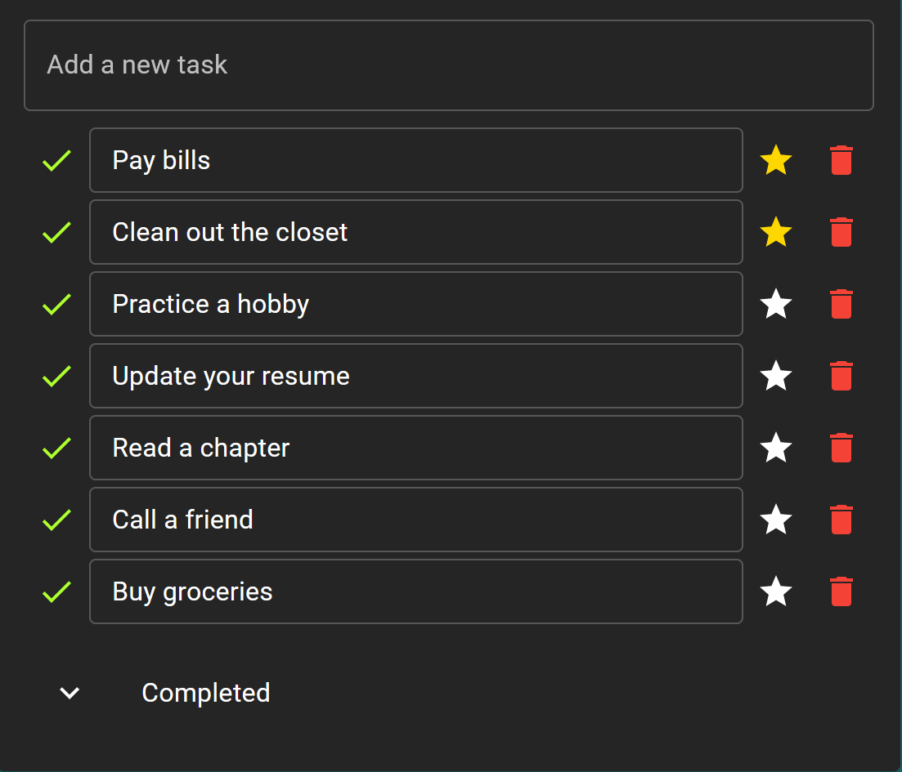

# Task Master - Web Application

Task Master is a web application built using React with Material-UI (MUI) that helps you manage your tasks efficiently. With Task Master, you can sign up, log in, and manage your todo list with ease. It also allows you to mark tasks as favorites, complete/uncomplete tasks, and delete tasks as needed.

## Features

- **Sign Up:** Users can create a new account by providing their details.

- **Log In:** Registered users can log in to their accounts.

- **Sign Out:** Users can securely sign out of their accounts.

- **Todo List:** Manage your tasks with a comprehensive todo list.

- **Favorites:** Mark tasks as favorites for quick access.

- **Complete/Uncomplete Tasks:** Keep track of completed and uncompleted tasks.

- **Delete Task:** Easily remove tasks from your list.

- **About Page:** An About page that provides information about this web application.

- **Router for Navigation:** Smooth navigation with the help of a router.

## Development setup

Clone the repo and run `npm install` or `yarn install`.
Run `npm start` or `yarn start` to start the local development server, by default at localhost:3000

