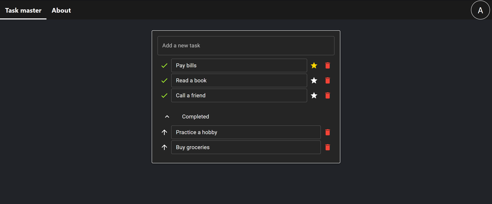

# Task Master

Task Master is a powerful todo list web application built using React with Material-UI (MUI).

Note:
_This project, TaskMaster, is a demonstration application created to showcase my React skills. It is not intended for production use, and certain features may be simplified or omitted._

### Features
- **Navigation**: Seamless page transitions with react-router-dom.
- **User Authentication**: Securely manage user accounts with sign-up and log-in forms.
- **Persistent Data Storage**: Utilizes local storage to retain todo list data even after closing the app.
- **GitHub Integration**: Fetches README.md from the GitHub repository for up-to-date info.
- **Stylish Design**: Modern appearance using Material-UI components.
- **Dynamic Navigation Bar**: Smooth animations enhance user interaction.
- **Responsive Design**: Adapts to various screen sizes for a consistent experience.

### Pages
- **Home (url `/`):** The landing page provides a preview of the app and offers sign-up and log-in buttons.
- **Dashboard (url `/`):** After logging in, users are directed to the dashboard, which displays the todo list.
- **About (url `/About`):** This page dynamically fetches and displays the README.md file from the GitHub repository, keeping users informed about the latest updates.
- **Log in (url `/login`):** Log-in form
- **Sign up (url `/sign-up`):** Sign-up form

### Todo List Functionality
- **Add task:** Add a new task to the list
- **Delete task:** Delete a task from the list
- **Un/complete task:** Mark a task as un/completed
- **Un/favorite task:** Mark a task as (not) favorite

### Local Storage
- Credentials of all users are stored in an item with key `credentials`
- Currently logged in user is stored in an item with key `user`
- Todo list data of all users is stored in an item with key `data`

## Development setup

Clone the repo and run `npm install` or `yarn install`.
Run `npm start` or `yarn start` to start the local development server, by default at localhost:3000

## Preview

Enjoy using Task Master to manage your tasks effectively and stay organized effortlessly! If you encounter any issues or have suggestions, feel free to contribute or raise an issue on the GitHub repository. Happy tasking!

